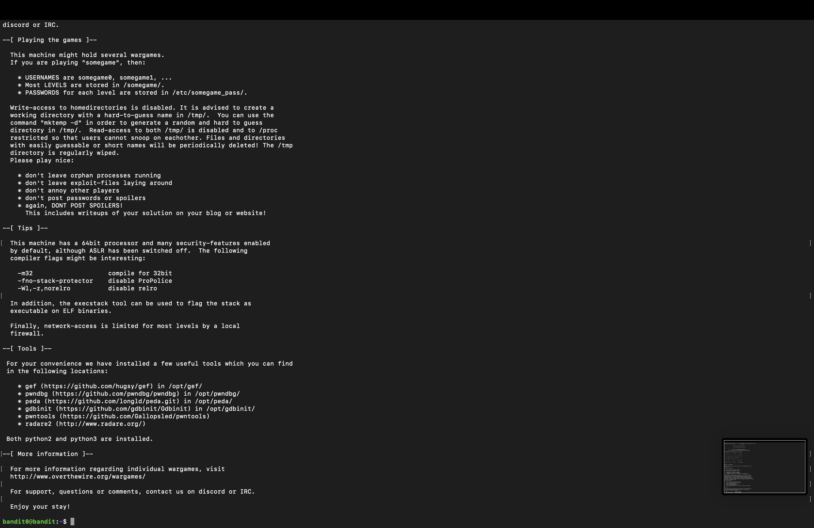

# Homework 1

## 0) Summarize
## Article Hutchins et al 2011: Intelligence-Driven Computer Network Defense Informed by Analysis of Adversary Campaigns and Intrusion Kill Chains
[Link to article](https://lockheedmartin.com/content/dam/lockheed-martin/rms/documents/cyber/LM-White-Paper-Intel-Driven-Defense.pdf "PDF document")

### Summary

The paper "Intelligence-Driven Computer Network Defense Informed by Analysis of Adversary Campaigns and Intrusion Kill Chains" discusses the use of intelligence and analysis of adversary campaigns to improve the defense of computer networks. 

It describes the concept of an intrusion kill chain, which is a sequence of steps that an attacker takes to gain access to and control of a network, and the use of this information to identify and disrupt the attack at an early stage. 

The paper also discusses the importance of using intelligence from multiple sources and integrating it with network defense systems to provide a more complete picture of the threat. The paper argues that this approach to network defense can be more effective than traditional methods that focus on blocking known attacks.

 The Cyberspace Kill Chain, also known as the Intrusion Kill Chain, is a framework used to describe the various stages of a cyber attack. The framework is designed to help organizations better understand and defend against cyber attacks by identifying the key stages of an attack and the actions that can be taken to prevent or disrupt it.

The stages of the Cyberspace Kill Chain are:

+ Reconnaissance: The attacker gathers information about the target, such as IP addresses, network topology, and vulnerabilities.
+ Weaponization: The attacker creates a weapon, such as a malware payload, that can be used to exploit vulnerabilities in the target.
+ Delivery: The weapon is delivered to the target, often through social engineering or phishing emails.
+ Exploitation: The weapon is used to exploit a vulnerability in the target, allowing the attacker to gain access to the network.
+ Installation: The attacker establishes a foothold on the network, such as installing malware or creating a back door.
+ Command and Control: The attacker establishes a communication channel with the malware or back door, allowing them to control the compromised system remotely.
+ Actions on Objective: The attacker achieves their objective, such as stealing sensitive information or disrupting operations.

By understanding the stages of the kill chain, organizations can develop and implement countermeasures at each stage to prevent or disrupt the attack. These countermeasures can include technical controls, such as firewalls and intrusion prevention systems, as well as non-technical controls, such as employee training and incident response plans.

## Karvinen 2020: Command Line Basics Revisited

Command line basics refer to the use of a command prompt or terminal to interact with a computer's operating system. These basic commands allow users to navigate, manipulate files, control remote systems, and perform administrative tasks.

+ Moving and looking around:
"pwd" (print working directory) shows the current directory you are in.
"ls" (list) lists the contents of the current directory.
"cd" (change directory) allows you to move to a different directory.
"mkdir" (make directory) creates a new directory.
+ File manipulation:
"cp" (copy) copies a file from one location to another.
"mv" (move) moves a file from one location to another.
"rm" (remove) deletes a file.
"touch" creates a new empty file.
+ SSH remote control:
"ssh" (secure shell) allows you to remotely control another system over an encrypted connection.
Help:
"man" (manual) provides documentation for a specific command.
"help" provides a list of available commands.
History and guessing:
"history" shows a list of previously executed commands.
"!number" execute the command that has that number on history list.
+ Important directories:
"~" (home directory) refers to the current user's home directory.
"/" (root directory) refers to the top-level directory of the file system.
"/usr" contains user-related files and programs.
"/var" contains variable files such as log files, backups, and spool files.
+ Admin commands:
"sudo" (superuser do) allows you to run a command with administrative privileges.
"chmod" (change mode) changes the permissions of a file or directory.
"chown" (change owner) changes the ownership of a file or directory.

These are just a few examples of the many command-line basics that are available. Understanding and using these basic commands can greatly improve a user's efficiency and productivity when working with a computer's operating system.

## a) Bandit oh-five. Solve Over The Wire: Bandit the first five levels (0-4).

### Level 0

I connected with Putty to the host bandit.labs.overthewire.org on the port 2220 with the provided username and same password: bandit0

### Level 1
cat readme
NH2SXQwcBdpmTEzi3bvBHMM9H66vVXjL

### Level 2
cat < -
rRGizSaX8Mk1RTb1CNQoXTcYZWU6lgzi

### Level 3
bandit2

cat "spaces in this filename"
aBZ0W5EmUfAf7kHTQeOwd8bauFJ2lAiG

### Level 4
bandit3
cd inhere
ls -a (-a to see hidden file)
cat .hidden
2EW7BBsr6aMMoJ2HjW067dm8EgX26xNe

## b) Bullseye. Install Debian 11-Bullseye virtual machine in VirtualBox.

Installed Debian 11-Bullseye virtual machine in VirtualBox.

## c) WebGoat. Install WebGoat practice target. 

Installed WebGoat practice target.
