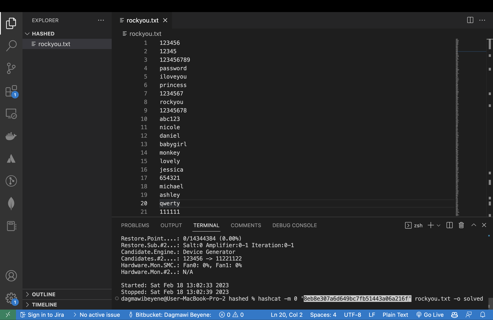
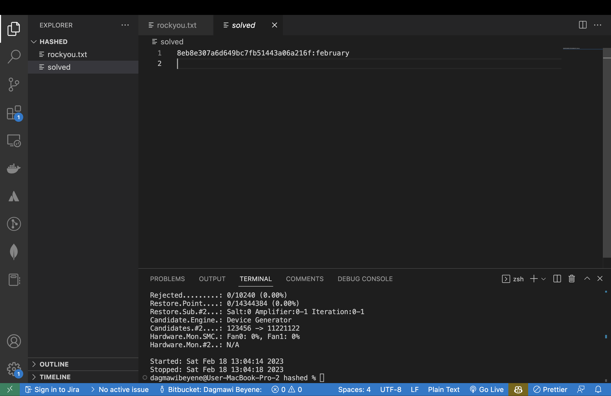
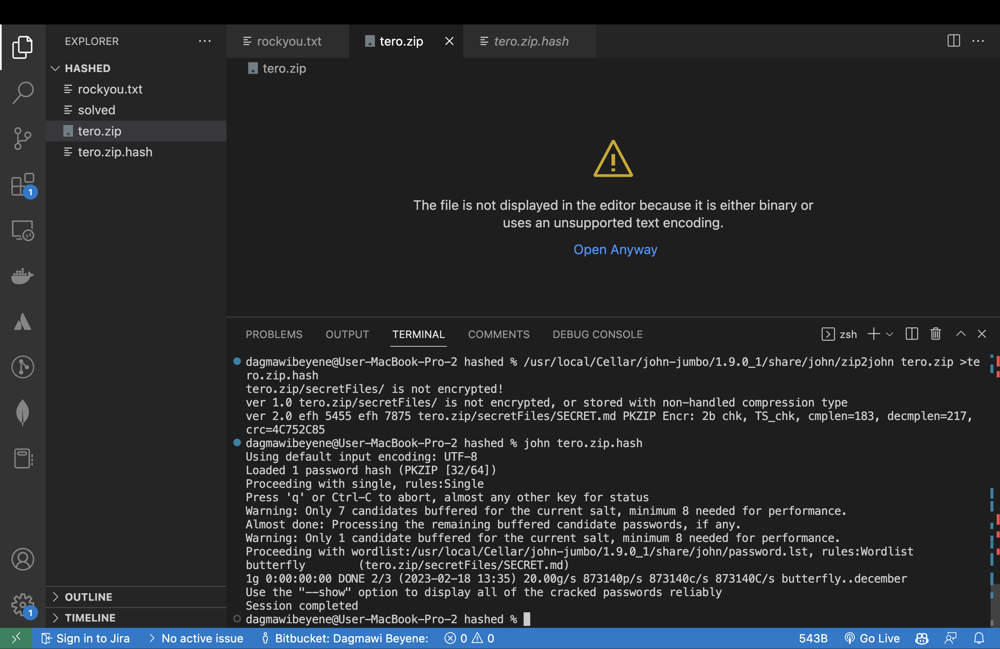

# Homework 3

## x) Summarize

## Costa-Gazcón 2021: Practical Threat Intelligence and Data-Driven Threat Hunting

### Chapter 4: Mapping the Adversary (

In Chapter 4 of the book "Practical Threat Intelligence and Data-Driven Threat Hunting" by Costa-Gazcón (2021), the author discusses the process of mapping an adversary, which involves identifying and analyzing the tools, techniques, and procedures (TTPs) used by the adversary to carry out attacks. The chapter covers the following topics:

+ The importance of mapping the adversary and understanding their TTPs to inform defensive strategies.
+ Techniques for collecting and analyzing threat intelligence, including open source intelligence (OSINT), closed source intelligence, and human intelligence (HUMINT).
+ The use of frameworks such as the MITRE ATT&CK framework to categorize and analyze adversary TTPs.
+ Strategies for identifying and tracking specific threat actors, including the use of indicators of compromise (IOCs) and tactics, techniques, and procedures (TTPs) associated with known threat groups.
+ The role of threat hunting in mapping the adversary, including proactive searches for signs of compromise and the use of data analytics to identify patterns and anomalies.

Overall, the chapter emphasizes the importance of mapping the adversary as a critical aspect of effective threat intelligence and defense.

## b) HASHCAT

I installed hashcat on my mac using homebrew. I used the following command to install hashcat:

```
brew install hashcat
```


I used the following command to run hashcat:


```
hashcat -m 0 '8eb8e307a6d649bc7fb51443a06a216f' rockyou.txt -o solved

```



I was able to crack the hash and the result was 
    
    ```
    8eb8e307a6d649bc7fb51443a06a216f:february
    ```


### a) John the Ripper

I installed John the Ripper on my mac using homebrew. I used the following command to install John the Ripper:

```
brew install john
```
### b) crack a zip file password

I have installed John the Ripper on my mac. I used the following command to get the hash of the zip file:

```
/usr/local/Cellar/john-jumbo/1.9.0_1/share/john/zip2john tero.zip >tero.zip.hash 
```

And I used the following command to crack the password:

```
john tero.zip.hash
```



The password is `butterfly`


