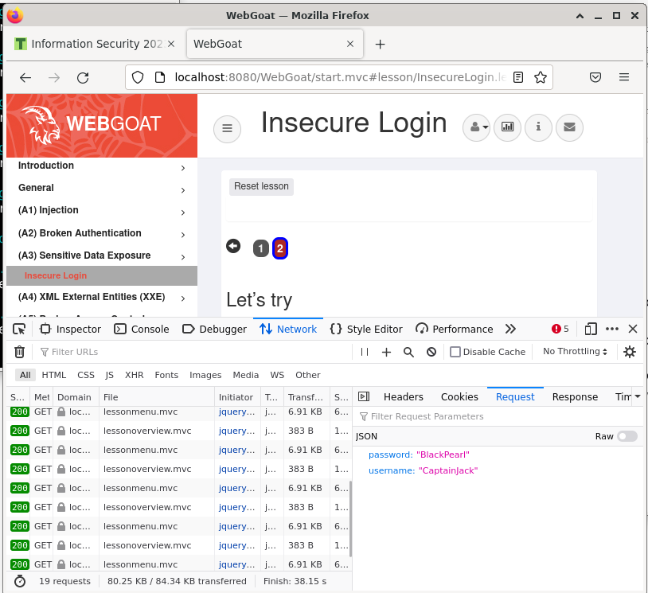

# Homework 3

## x) Summarize

## Costa-Gazcón 2021: Practical Threat Intelligence and Data-Driven Threat Hunting

### Chapter 4: Mapping the Adversary (

In Chapter 4 of the book "Practical Threat Intelligence and Data-Driven Threat Hunting" by Costa-Gazcón (2021), the author discusses the process of mapping an adversary, which involves identifying and analyzing the tools, techniques, and procedures (TTPs) used by the adversary to carry out attacks. The chapter covers the following topics:

+ The importance of mapping the adversary and understanding their TTPs to inform defensive strategies.
+ Techniques for collecting and analyzing threat intelligence, including open source intelligence (OSINT), closed source intelligence, and human intelligence (HUMINT).
+ The use of frameworks such as the MITRE ATT&CK framework to categorize and analyze adversary TTPs.
+ Strategies for identifying and tracking specific threat actors, including the use of indicators of compromise (IOCs) and tactics, techniques, and procedures (TTPs) associated with known threat groups.
+ The role of threat hunting in mapping the adversary, including proactive searches for signs of compromise and the use of data analytics to identify patterns and anomalies.

Overall, the chapter emphasizes the importance of mapping the adversary as a critical aspect of effective threat intelligence and defense.

## y) Mitre Att&ck

The MITRE ATT&CK framework is a widely used framework for categorizing and analyzing the tactics, techniques, and procedures (TTPs) used by attackers during different stages of a cyberattack. Understanding these TTPs can help organizations identify and defend against potential attacks.

In the context of the MITRE ATT&CK framework, a tactic refers to a high-level goal or objective that an attacker is trying to accomplish during an attack. There are several tactics defined in the framework, including Initial Access, Execution, Persistence, Privilege Escalation, Defense Evasion, Credential Access, Discovery, Lateral Movement, Collection, Exfiltration, and Command and Control. For example, an attacker may use the Initial Access tactic to gain access to a victim's network or system.

A technique, on the other hand, is a specific method or approach used by an attacker to achieve a particular objective within a given tactic. Each technique is assigned a unique identifier and can have one or more subtechniques, which represent more granular methods or approaches. For example, the technique "Phishing" is used to achieve the Initial Access tactic and can include subtechniques such as "Spearphishing Link" and "Spearphishing Attachment".

Subtechniques are further detailed breakdowns of techniques, providing more specific information on how a technique may be performed. For instance, "Spearphishing Attachment" can be broken down into subtechniques such as "Malicious Word Document" and "Malicious PDF."

Procedures, also known as "Tactics, Techniques, and Procedures" (TTPs), refer to the specific steps an attacker follows to achieve their objectives. These can include the tools and techniques used, as well as the sequence of actions taken by the attacker. An example of a procedure is the "DNS Tunneling" technique, which involves the use of a DNS server to exfiltrate data from a victim's network.

In conclusion, the MITRE ATT&CK framework provides a standardized approach for understanding the tactics, techniques, and procedures used by attackers in various stages of a cyberattack. By using this framework, organizations can better prepare their defenses and detect and respond to potential threats.

ref: 
MITRE ATT&CK. (n.d.). Tactics and Techniques. Retrieved from https://attack.mitre.org/tactics/
MITRE ATT&CK. (n.d.). Techniques. Retrieved from https://attack.mitre.org/techniques/

The references are all from the official MITRE ATT&CK website, which provides comprehensive information on the framework and its components.

### a) Webgoat: A3 sensitive data exposure

#### 1. Insecure Login

I used the following credentials to log in to the WebGoat application:

+ Username: guest
+ Password: guest

Then I went to network tab on firefox and clicked on the login button. I saw that the password was sent in plain text. This is a security vulnerability because if an attacker were to intercept the request, they would be able to see the password in plain text.

