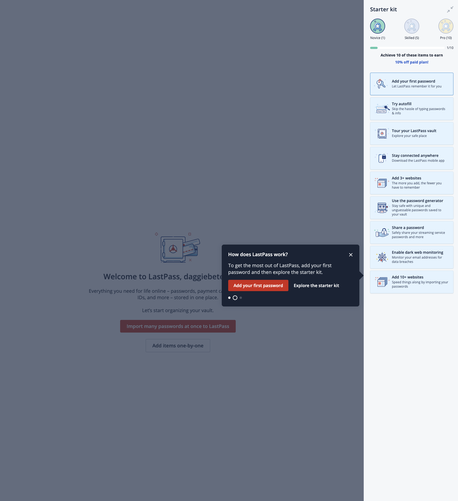
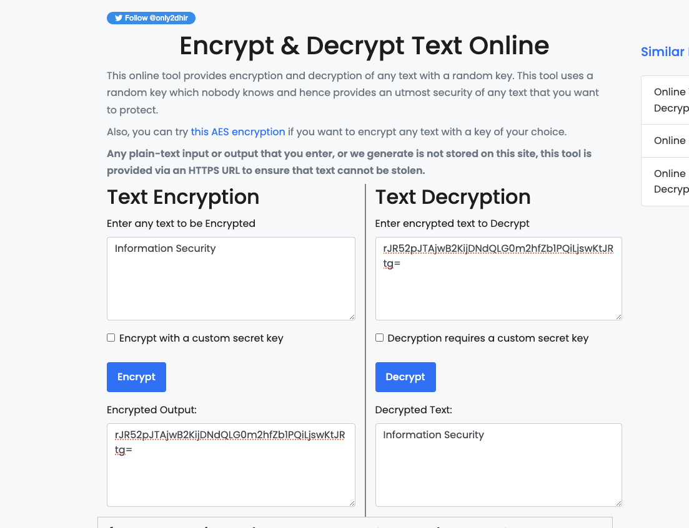

# Homework 3

## x) Summarize

## Schneier 2015: Applied Cryptography

### Chapter 10: Using Algorithms (

In section 10 of his book "Applied Cryptography," Bruce Schneier discusses the use of algorithms in cryptography. Here are some key points from subsections 10.1 to 10.4:

- In 10.1, Schneier explains that an algorithm is a precise set of instructions for carrying out a computation or solving a problem. In cryptography, algorithms are used to transform plaintext into ciphertext and vice versa.
- In 10.2, Schneier describes some common cryptographic algorithms, including symmetric-key algorithms like DES and AES, and public-key algorithms like RSA and Diffie-Hellman. He notes that the choice of algorithm depends on factors like security, efficiency, and compatibility with other systems.
- In 10.3, Schneier discusses the importance of key length in cryptographic algorithms. Longer keys generally provide greater security against attacks like brute force or exhaustive search, but also require more computational resources to use.
- In 10.4, Schneier introduces the concept of dereferencing keys, which involves using a key to look up another key or piece of information. He notes that this can introduce additional security risks if not done carefully, since an attacker who gains access to one key may be able to use it to access others.

Overall, these subsections provide a useful overview of the role of algorithms in cryptography and some of the key considerations involved in their use.

## y) Password managers

One password manager that I would recommend is LastPass. It protects against threats such as password theft, phishing attacks, and other types of cyber attacks that can compromise your personal information.

LastPass encrypts information such as passwords, credit card information, and other sensitive data. However, some information such as your username and website information may not be encrypted.

LastPass has both a free and a premium license. The free license allows you to store and manage passwords on one device, while the premium license offers additional features such as multi-device access and priority tech support.

The data is stored in the cloud, but LastPass uses strong encryption methods to ensure that your data is secure. The company has servers located in various countries, including the United States, Canada, and Europe. However, they do not disclose which companies they use for their infrastructure.

LastPass uses various security measures such as two-factor authentication, encryption, and secure protocols to protect your data. Additionally, they regularly conduct security audits and have a bug bounty program to ensure that their system is secure.

### a) LastPass

#### 1. Demo of LastPass

Create an account on LastPass's website.

Install the LastPass browser extension or mobile app.

Log in to LastPass and create a master password.

Use LastPass to generate and store unique, strong passwords for each website or service you use.

When you visit a website, LastPass will automatically fill in your login information for you.

### b) encryption and decryption

we can use online tools to encrypt and decrypt text. I used the following website to encrypt and decrypt text: https://www.devglan.com/online-tools/text-encryption-decryption

